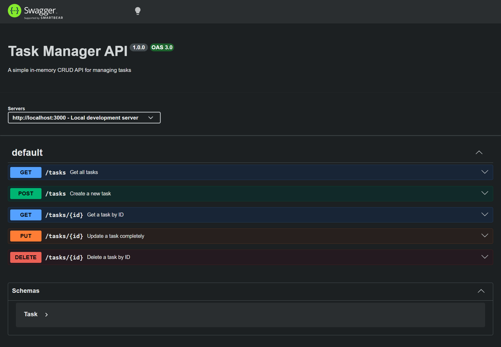

# Tasks API

A REST API for managing tasks, built with Express.js and PostgreSQL. The application is containerized with Docker and Docker Compose.

## What this is

Tasks API is a backend application that supports creating, reading, updating, and deleting tasks.

The project uses:

- Node.js
- Express.js
- PostgreSQL
- Docker
- Docker Compose
- Swagger UI

The Express API and PostgreSQL database run in separate Docker containers and communicate through Docker's internal network.

Swagger UI documentation is available at:

- http://localhost:3000/api-docs/

---

## Getting Started

### Prerequisites

Make sure you have [Docker Desktop](https://www.docker.com/products/docker-desktop/) installed.

### Run with Docker

1. **Clone the repository:**

   ```bash
   git clone https://github.com/osegee/Tasks-API.git
   ```

2. **Navigate into the project:**

   ```bash
   cd Tasks-API
   ```

3. **Start the application:**
   ```bash
   docker compose up
   ```

This starts:

- The Express API container
- The PostgreSQL container
- A persistent PostgreSQL volume

The API will be available at: [http://localhost:3000](http://localhost:3000)  
Swagger UI: [http://localhost:3000/api-docs/](http://localhost:3000/api-docs/)

### Stop the Containers

To stop the application, run:

```bash
docker compose down
```

> **Note:** Running `docker compose down` keeps the database data. Running `docker compose down -v` removes the PostgreSQL volume and deletes all stored data.

---

## Endpoints

| Method     | Path         | Description         | Success Status |
| :--------- | :----------- | :------------------ | :------------- |
| **GET**    | `/`          | Basic API info      | 200            |
| **GET**    | `/health`    | Health check        | 200            |
| **GET**    | `/tasks`     | List all tasks      | 200            |
| **GET**    | `/tasks/:id` | Get one task by ID  | 200            |
| **POST**   | `/tasks`     | Create a task       | 201            |
| **PUT**    | `/tasks/:id` | Update a task by ID | 200            |
| **DELETE** | `/tasks/:id` | Delete a task by ID | 204            |

### Example Request

Get all tasks:

```bash
curl -i http://localhost:3000/tasks
```

### Example Response

```json
[
  {
    "id": 1,
    "title": "Learn Docker",
    "done": false
  }
]
```

---

## Database

The application uses PostgreSQL for persistent data storage. The database schema is located at:

```text
src/
└── db/
    └── schema.sql
```

When the PostgreSQL container is initialized for the first time, Docker automatically runs `schema.sql` to create the required tables. Database data is stored in a Docker volume, so it persists even when the containers are stopped and recreated.

---

## Architecture

```text
                    Docker Compose
                         │
             ┌───────────┴───────────┐
             │                       │
             ▼                       ▼
      ┌──────────────┐        ┌──────────────┐
      │ API Container│        │ DB Container │
      │              │        │              │
      │ Node.js      │───────▶│ PostgreSQL   │
      │ Express.js   │  db    │              │
      │              │        │ tasks DB     │
      └──────────────┘        └──────┬───────┘
                                     │
                                     ▼
                              PostgreSQL Volume
```

---

## Project Structure

```text
Tasks-API/
├── src/
│   ├── config/
│   │   └── db.js
│   ├── db/
│   │   └── schema.sql
│   └── ...
├── Dockerfile
├── docker-compose.yml
├── package.json
└── README.md
```

---

## Swagger screenshot


